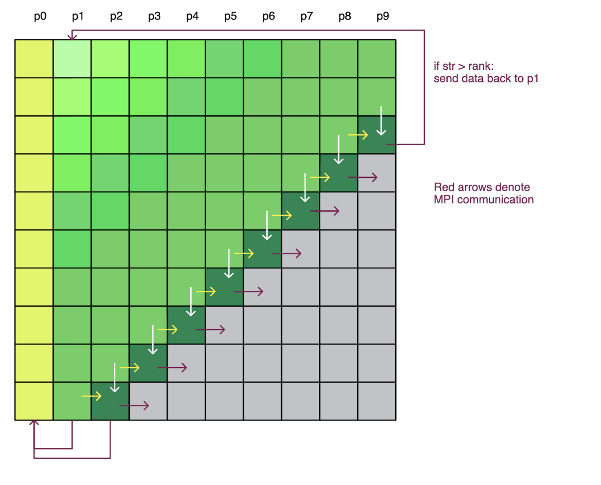

# Parallizing the Smith-Waterman Sequence Alignment Algorithm Using `mpi4py` 🧬

The Smith-Waterman (SW) local sequence alignment algorithm is one of the central algorithms in bioinformatics. While the algorithm is guaranteed to find the best local alignment between two sequences, it suffers from an extremely slow quadratic runtime. As such, less-sensitive heuristic algorithms are often used in its place. There remains a need for faster, parallel implementations of Smith-Waterman to make it a feasible option for larger sequence alignment tasks.

This repository contains three implementations of the SW algorithm: a serial implementation (`serial-sw.py`), and two parallel implementations (`blocking-mpi-sw.py` and `diag-mpi-sw.py`). The parallel implementations utilize the message passing interface (MPI) protocol for distributed memory computing. They were developed in python using the `mpi4py` library. Inital benchmarking tests shows the diagonal wavefront implemention demonstrates a ~25X speedup over the serial implementaion, and the blocking implementaion demonstrates a ~16X speedup. 

## Running each implementation:

### Serial 

To run on a custom sequence:

`python serial-sw.py -query <query sequence> -reference <reference sequence>`

To run on the main example sequences from wikipedia: 

`python serial-sw.py --test 1`

To run on two randomly generated sequences of a given length (for scaling testing):

`python serial-sw.py --length <int of length>`

### Parallel 
The command line interface for the parallel implementions, `blocking-mpi-sw.py` and `diag-mpi-sw.py` use the same flags as the interface for `serial-sw.py` described above. However, these will of course need to be run on a distributed memory system. The syntax for deploying the program on the particular computer cluster you are using may vary.   

These implementations were tested on the Cori supercompter located at [NERSC](https://www.nersc.gov/). The workload manager used for NERSC's computers is SLURM, which is amoung most common workload managers used by modern supercomputers and computer clusters. The syntax for running these programs on a SLURM-managed cluster is outlined below. An example batch script is saved in the repo under `run_parallel`. The expected output from running run_paralell is seen in run_parallel_output.out

#### Blocking 

To run on a custom sequence:

`srun -N 1 --ntasks-per-node=<number of processes> python blocking-mpi-sw.py -query <query sequence> -reference <reference sequence>`

To run on the main example sequences from wikipedia:

`srun -N 1 --ntasks-per-node=<number of processes> python blocking-mpi-sw.py --test 1`

To run on two randomly generated sequences of a given length (for scaling testing):

`srun -N 1 --ntasks-per-node=<number of processes> python blocking-mpi-sw.py --length <int of length> --seed 1`

Below shows a visual depiction of filling the alignment matrix in the blocking implementaiton. The blocking technique involves dividing the matrix into equally sized blocks of N columns, and assigning each processor one block. Unique processes/ranks are denoted by p#:

#### Diagonal Wavefront 

To run on a custom sequence:

`srun -N 1 --ntasks-per-node=<number of processes> python diag-mpi-sw.py -query <query sequence> -reference <reference sequence>`

To run on the main example sequences from wikipedia:

`srun -N 1 --ntasks-per-node=<number of processes> python diag-mpi-sw.py --test 1`

To run on two randomly generated sequences of a given length (for scaling testing):

`srun -N 1 --ntasks-per-node=<number of processes> python diag-mpi-sw.py --length <int of length> --seed 1`

Below shows a visual depiction of filling the alignment matrix in the diagonal wavefront implementation. In this implementation, the alignment matrix is filled one diagonal at a time, and each processor computes one entry in the diagonal at each step. Unique processes/ranks are denoted by p#:

